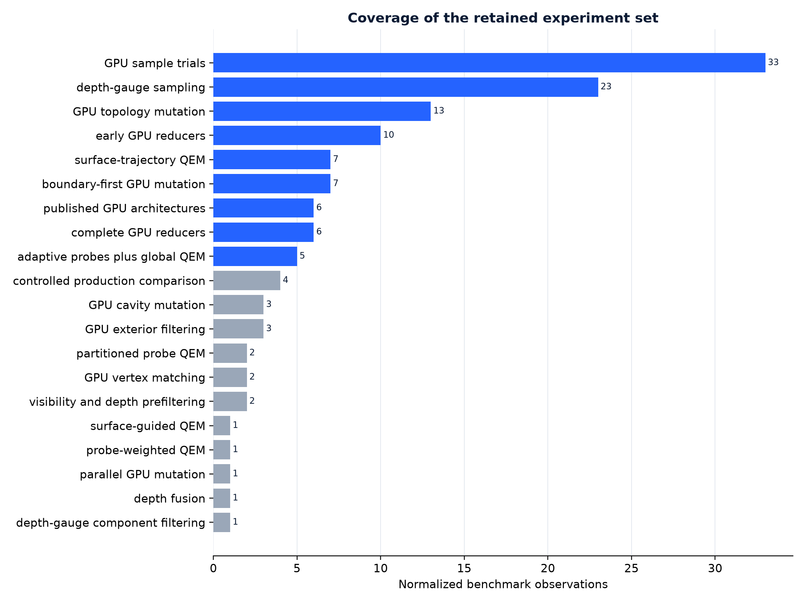
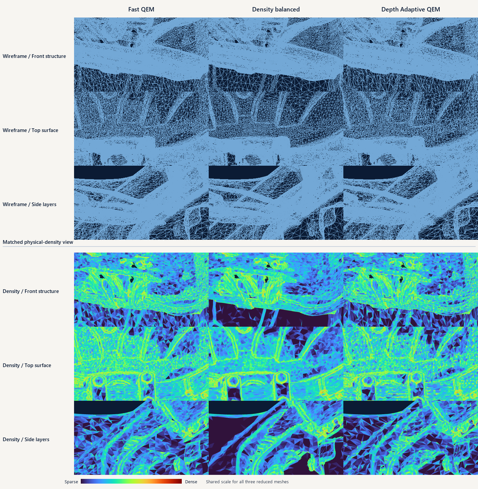
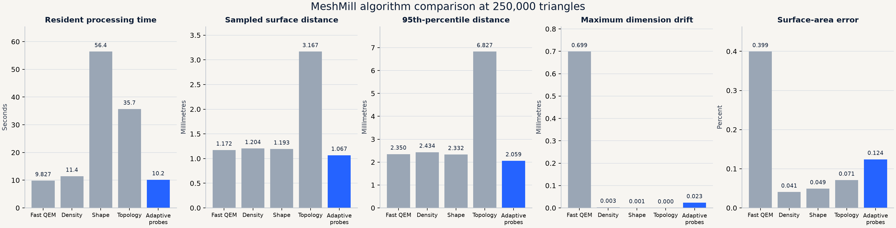
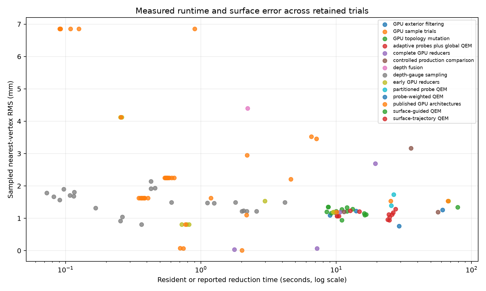
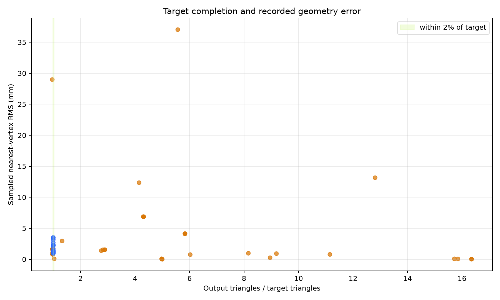
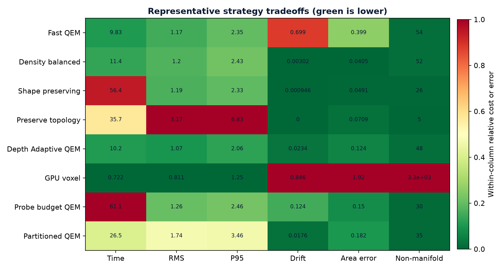
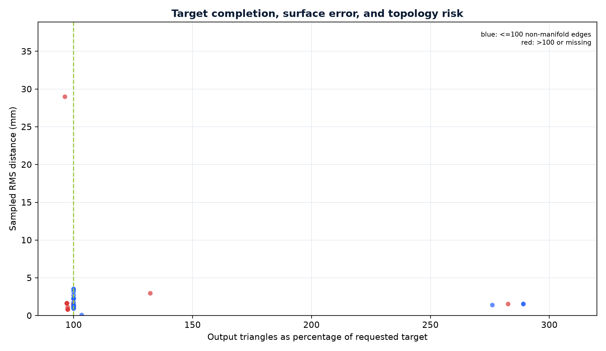

# Depth Adaptive QEM: GPU-Guided Physical Probes for Quality-Preserving Mesh Simplification

**Publisher:** Make Your Own World

**Version:** 1.1
**Published:** October 7, 2026

## Abstract

Dense scanned meshes often contain highly sampled flat surfaces, dust, duplicated layers, open
boundaries, and disconnected components. Standard triangle reduction treats geometric error but
does not directly distinguish useful form from dense acquisition noise. GPU implementations can
evaluate surface statistics quickly, yet complete GPU edge-collapse reducers may lose quality,
damage topology, stall above the requested count, or spend most of their time coordinating
irregular topology mutation.

This paper presents Depth Adaptive QEM, an adaptive physical-probe method derived from the behavior of a mechanical
depth gauge. Probe diameter, rounded-tip radius, and sampling pitch are calculated from source
geometry and the requested output count. Coherent flat trajectories are represented with coarse
probes. Curved and unresolved regions receive progressively denser probes. Small statistically
supported excursions are projected toward a local surface trajectory under a strict physical
displacement bound. The original face connectivity is retained and one global Fast Quadric Error
Metric pass assembles the reduced mesh.

On a 4,126,315-triangle composite scan reduced to 249,999 triangles, the candidate improved sampled
RMS surface distance from 1.1721 mm to 1.0668 mm, P95 distance from 2.3504 mm to 2.0586 mm, maximum
dimension drift from 0.6987 mm to 0.0234 mm, and surface-area error from 0.3993% to 0.1241% relative
to Fast QEM. Resident processing time increased from 9.827 seconds to 10.156 seconds. GPU clustering,
direct GPU QEM, RXMesh QSlim, visibility filtering, attribute-weighted QEM, and independently reduced
probe partitions did not match this combination of completion, speed, and measured quality on the
same source geometry.

## 1. Problem

A scanner can represent one broad surface with millions of triangles even when most samples add no
useful macroscopic form. Dust and acquisition noise may produce local geometric variation that a
reducer interprets as detail. Layered scans also contain neighboring surfaces that are spatially
close but topologically unrelated. A useful reducer must remove unnecessary density without merging
those layers, flattening unresolved features, breaking open boundaries, or producing disconnected
regional output.

The practical target is an editable mesh with substantially fewer triangles and similar observable
form. Runtime matters, but reaching the requested count quickly is not useful if surface distance,
dimensions, topology, or boundaries deteriorate.

## 2. Contribution and provenance

The original contribution is the physical depth-gauge model:

1. Treat local surface measurement as an array of finite-diameter probes with rounded ends.
2. Calculate probe dimensions from the source mesh rather than exposing generic resolution knobs.
3. Use the widest probe spacing that explains a coherent local trajectory.
4. Refine probe spacing only where normal variation or residual error requires it.
5. Remove only supported excursions within the rounded probe tip's physical scale.
6. Leave unresolved geometry unchanged.
7. Preserve global topology and use one established QEM pass for final assembly.

Quadric error metrics, tangent-plane fitting, orthogonal projection, GPU segmented reductions, and
edge-collapse assembly are established components. Published GPU simplification research supplied
comparison architectures and implementation guidance. It did not supply the adaptive physical-probe
model described here.

## 3. Physical probe geometry

Let an indexed mesh contain vertices $V$, edges $E$, faces $F$, surface area $A_M$, and a
requested output count $N$. The physical probe diameter is the median valid source-edge length:

$$
d=\mathrm{median}\left\lbrace\lVert\mathbf v_i-\mathbf v_j\rVert:(i,j)\in E\right\rbrace.
$$

`d` is probe diameter in mesh units; `E` is the set of mesh edges; `v_i` and
`v_j` are the 3D positions at an edge's endpoints; and `||v_i - v_j||` is that edge's length. The
median makes the probe body match
ordinary source sampling while resisting isolated extremely short or long edges.

The hemispherical tip radius is

$$
r=\frac d2.
$$

`r` is the rounded probe-tip radius and `d` is the derived probe diameter.
The half-diameter radius gives each virtual probe a hemispherical end rather than a dimensionless
tolerance.

For $N$ ideal equilateral output triangles, representative edge length is

$$
p_o=\sqrt{\frac{4A_M}{\sqrt 3N}}.
$$

`p_o` is the representative output edge length; `A_M` is total source surface
area in squared mesh units; `N` is the requested output-triangle count; and `sqrt(3)/4` is the
area coefficient of an equilateral triangle. This converts a triangle budget into physical spacing.

The finest probe pitch and tested hierarchy are

$$
p_{\min}=\max(d,p_o),
\qquad
P=\{8p_{\min},4p_{\min},2p_{\min},p_{\min}\}.
$$

`p_min` is the finest permitted probe spacing; `d` prevents spacing below the
source's ordinary edge scale; `p_o` prevents spacing below what the requested output can represent;
and `P` is the coarse-to-fine hierarchy tested for each face.

The method begins at $8p_{\min}$. A face advances to a denser probe population only when the
coarser population cannot represent its local surface safely.

## 4. Adaptive trajectory analysis

For spatial probe cell $c$, face $f$ has area $A_f$, unit normal $\mathbf n_f$, and center
$\mathbf c_f$. The area-weighted local normal and center are

$$
\mathbf n_c=\frac{\sum_{f\in c}A_f\mathbf n_f}
{\left\lVert\sum_{f\in c}A_f\mathbf n_f\right\rVert},
\qquad
\mathbf o_c=\frac{\sum_{f\in c}A_f\mathbf c_f}{\sum_{f\in c}A_f}.
$$

`c` is one spatial probe cell; `f` is a face assigned to it; `A_f` is face area;
`n_f` is the face unit normal; `c_f` is the face center; `n_c` is the normalized area-weighted cell
normal; and `o_c` is the area-weighted cell center.
Larger triangles therefore contribute in proportion to represented surface area.

Normal coherence is

$$
h_c=\frac{\left\lVert\sum_{f\in c}A_f\mathbf n_f\right\rVert}{\sum_{f\in c}A_f},
$$

`h_c` is normal coherence on a 0-to-1 scale. Values near 1 mean the faces point
in nearly the same direction; lower values indicate curvature, folds, opposing layers, or mixed
surface directions inside the cell.

and face-center residual is

$$
e_f=\left|\mathbf n_c\cdot(\mathbf c_f-\mathbf o_c)\right|.
$$

`e_f` is the perpendicular distance from face center `c_f` to the
cell's fitted tangent plane; the dot product measures displacement along the cell normal; and the
absolute value treats excursions on either side equally.

Residuals above $\mu_c+2.5\sigma_c$ do not define the fitted trajectory. With inlier indicator
$I_f$, the clipped RMS residual is

$$
R_c=\sqrt{\frac{\sum_{f\in c}A_fI_f e_f^2}{\sum_{f\in c}A_fI_f}}.
$$

`R_c` is the cell's area-weighted RMS residual; `I_f` is 1 for an inlier and
0 for a rejected statistical outlier; `e_f^2` emphasizes larger departures; and the denominator
normalizes by the accepted surface area. It asks whether the cell behaves like one coherent surface.

The rounded probe tip supplies a pitch-dependent angular limit:

$$
\theta_p=\tan^{-1}\left(\frac r{p/2}\right),
\qquad h_c\ge\cos\theta_p.
$$

`theta_p` is the largest normal-angle variation allowed at probe pitch `p`; `r`
is tip radius; and `h_c` is measured coherence. Wide probe spacing produces a small angular
allowance, while closer probes can follow tighter curvature.

A cell is accepted at pitch $p$ when that coherence test passes and $R_c\le r$. Long flat
surfaces therefore use few probes. Curved or conflicting regions refine until represented or remain
unresolved.

## 5. Bounded surface correction

A face is eligible for projection only when it belongs to an accepted trajectory and its excursion
falls within the rounded-tip interval

$$
\frac r2<e_f\le\frac{3r}{2}.
$$

`e_f` is the face's plane residual and `r` is probe-tip radius. Very small
variation is left alone, supported scan-scale excursions inside the rounded-tip band may be
corrected, and larger departures are treated as unresolved geometry rather than noise.

For incident vertex $\mathbf v$, the orthogonal projection is

$$
\mathbf v'=\mathbf v-\mathbf n_c
\left(\mathbf n_c\cdot(\mathbf v-\mathbf o_c)\right).
$$

`v` is an original vertex; `v'` is its proposed projection; `n_c` and `o_c`
define the local fitted plane. The scalar dot product finds the
normal-direction offset, which is subtracted without sliding the vertex along the surface.

Incident-face proposals are area-weighted per vertex. Total displacement is capped at
$d_{\max}=r/4$. The source face index array remains unchanged. Geometry unresolved at the finest
probe pitch is not projected.

## 6. Global QEM assembly

For supporting plane $\mathbf p=(a,b,c,d)^T$, the plane quadric is

$$
K_p=\mathbf p\mathbf p^T.
$$

`p = (a,b,c,d)^T` is a normalized supporting plane in homogeneous form; `K_p` is
its 4-by-4 symmetric error matrix; and the outer product records squared distance to that
plane for later collapse candidates.

For edge $(i,j)$, summed quadric and candidate cost are

$$
Q_{ij}=Q_i+Q_j,
\qquad
\epsilon_{ij}(\bar{\mathbf v})=\bar{\mathbf v}^{T}Q_{ij}\bar{\mathbf v}.
$$

`Q_i` and `Q_j` are the accumulated plane quadrics at the edge endpoints;
`Q_ij` is their sum; `v_bar = (x,y,z,1)^T` is a proposed homogeneous replacement vertex; and
`epsilon_ij` is the estimated squared geometric error used to rank the collapse.

One boundary-preserving Fast QEM pass accepts collapses according to geometric cost and validity.
Because the probe stage retains connectivity, the reducer operates on one global mesh instead of
welding independently simplified regions after the fact.

## 7. GPU execution profile

The surface-analysis stage consists mainly of regular vector operations: triangle normals, centers,
spatial keys, weighted segmented sums, residuals, masks, and projections. Ray and depth analysis have
the same favorable execution shape. For ray origin $\mathbf o_q$ and direction $\mathbf d_q$,

$$
\mathbf r_q(t)=\mathbf o_q+t\mathbf d_q,
\qquad
z_q(u,v)=\min\{t\ge0:\mathbf r_q(t)\cap M\ne\varnothing\}.
$$

`q` is one independent ray; `o_q` and `d_q` define it; `M` is the source mesh;
and `z_q(u,v)` is the nearest intersection depth at image sample `(u,v)`. Each query returns a
fixed-size result without changing the acceleration structure being traversed.

Thousands of rays, triangles, or probe cells can therefore run concurrently. Neighboring queries
usually follow coherent traversal paths and access nearby data. Nearest-depth tests, weighted sums,
histograms, segmented reductions, and projection proposals are regular operations with predictable
outputs. Once the geometry and traversal structure are resident, the setup cost is amortized across
the complete query field. In the retained benchmark, multiscale surface analysis took 0.581 seconds
on the GPU and 5.819 seconds on the CPU, about a 10-times speedup for that stage.

Depth is inexpensive measurement, not automatic reconstruction. A nearest-hit field omits hidden
layers, back-facing sheets, and some cavities. Multi-view depth improves coverage but still requires
decisions about visibility, correspondence, layer identity, open boundaries, and topology. This is
why the controlled method uses depth-like evidence for bounded correction and leaves unresolved
geometry unchanged. Depth fusion that fills intervals is a different, potentially useful solid-
synthesis objective, but it is destructive when the objective is faithful reduction of an open or
layered scan.

QEM edge-collapse mutation has the opposite execution profile. Candidate quadric costs can be
calculated in parallel, but each accepted collapse modifies adjacency, active faces, boundaries,
manifold classification, local quadrics, neighboring costs, triangle-validity tests, and later
priority decisions. Safe simultaneous collapses require disjoint affected neighborhoods:

$$
C(e_a)\cap C(e_b)=\varnothing.
$$

`e_a` and `e_b` are two proposed edge collapses; `C(e)` is every vertex, edge,
face, and adjacency record affected by collapse `e`; and the empty intersection means the
operations can proceed together without writing the same topology. Finding large safe sets changes
after every accepted collapse, which is the central GPU coordination cost.

Conflict discovery, variable-length adjacency, scattered updates, synchronization, atomic access,
branch divergence, and repeated priority construction limit useful parallelism. Conservative batches
preserve validity but expose little parallel work and can stall. Relaxed batches make more progress
using stale or conflicting choices, which changes collapse order and can damage topology or surface
shape. The safe set and its costs must be reconsidered after every accepted batch.

Eliminating PCIe transfer does not eliminate those dependencies. Resident VRAM helps both workloads,
but arithmetic and memory bandwidth are not the limiting resources for ordered mutation. The tested
conservative GPU QEM took 66.936 seconds and stopped at 722,687 triangles. The parallel GPU QEM took
25.282 seconds and stopped at 706,682 triangles with topology damage. The complete GPU QEM reached
249,999 triangles in 19.486 seconds, excluding 11.706 seconds of mutable-connectivity construction,
but its sampled RMS and P95 errors were substantially worse than Fast QEM. CPU Fast QEM completed in
9.827 seconds in the matched resident comparison.

The result does not imply that graphics processors are unsuitable for geometry. They were highly
effective at read-mostly surface measurement and poor at the tested dependency-heavy mutation paths.
Depth Adaptive QEM therefore uses GPU analysis to improve the surface evidence and one native global
Fast QEM pass to perform topology mutation. This division reached 249,999 triangles in 10.156 seconds
while improving sampled RMS from 1.1721 mm to 1.0668 mm and P95 from 2.3504 mm to 2.0586 mm.

### 7.1 Mathematical comparison of evaluated strategies

The 22 recorded experiment families reduce to seven distinct mathematical strategies. Comparing
their objectives explains more than comparing implementation languages or processor labels.

**Spatial and feature voxel clustering.** A vertex is assigned to a cubic cell of width (h):

$$
\mathbf k_h(\mathbf v)=\left\lfloor\frac{\mathbf v-\mathbf b}{h}\right\rfloor,
\qquad
\hat{\mathbf v}_{\mathbf k}=\frac{1}{|S_{\mathbf k}|}\sum_{\mathbf v\in S_{\mathbf k}}\mathbf v.
$$

`v` is a source vertex; `b` is the mesh's lower bound; `h` is voxel width;
`k_h(v)` is the integer cell address; `S_k` is the set of vertices in that cell; and `v_hat_k` is
their replacement centroid. This is fast because every vertex can be classified independently, but
spatial proximity alone can merge opposing layers, sharp edges, or disconnected surfaces.

Feature voxel trials appended a quantized normal key:

$$
\mathbf g(\mathbf v)=\left(\mathbf k_h(\mathbf v),
\mathrm{round}\left[s(\mathbf n(\mathbf v)+\mathbf 1)\right]\right).
$$

`g(v)` is the combined cluster address; `n(v)` is the vertex normal; `s` controls
normal-bin resolution; and `1` shifts signed normal components into a nonnegative range. The extra
key reduces cross-surface welding, but fixed spatial cells still create discontinuous cluster seams.

**Quadric clustering.** Instead of replacing a cell by its centroid, incident quadrics are summed
and the cell representative minimizes their shared plane error:

$$
Q_{\mathbf k}=\sum_{i\in S_{\mathbf k}}Q_i,
\qquad
\hat{\mathbf v}_{\mathbf k}=\arg\min_{\bar{\mathbf v}}
\bar{\mathbf v}^{T}Q_{\mathbf k}\bar{\mathbf v}.
$$

`Q_i` is the accumulated plane quadric at source vertex `i`; `Q_k` is the cell's
combined quadric; and `v_hat_k` is the least-plane-error cell representative. It improves placement
inside each cell, but it does not repair the topology loss caused by assigning geometry to fixed
cells before collapse ordering.

**Attribute-weighted probe budgets.** The probe-density trial augmented geometric error with a
continuous importance field:

$$
E'(\mathbf x)=E_{\mathrm{geom}}(\mathbf x)+\lambda E_{\mathrm{probe}}(\mathbf x).
$$

`E_geom` is ordinary quadric geometry error; `E_probe` penalizes changes to the
interpolated probe-density attribute; and `lambda` is the attribute weight. Preserving a scalar's
value is different from allocating a triangle count, so the method became slower without enforcing
the intended local budget.

**Partitioned triangle budgets.** Regional trials assigned a target to probe level (l):

$$
N_l=\mathrm{round}\left(
N\frac{n_lw_l}{\sum_m n_mw_m}\right).
$$

`N` is the global target; `n_l` is the source-face count at level `l`; `w_l` is
its desired density weight; and `N_l` is that region's target. Independent reduction pins region
interfaces and removes globally useful collapse choices. Welding afterward cannot restore the lost
global ordering.

**Multi-view visibility filtering.** A face support score was estimated from depth maps:

$$
s_f=\frac{1}{K}\sum_{q=1}^{K}
\mathbf 1\left[|z_{f,q}-z^{\min}_{q}(u_f,v_f)|\le\delta\right].
$$

`K` is the number of views; `z_f,q` is the face depth in view `q`; `z_min` is the
nearest sampled depth at the projected pixel `(u_f,v_f)`; `delta` is depth tolerance; and the
indicator contributes 1 when the face appears externally supported. Conservative tolerance removed
almost nothing, while stronger filtering deleted valid disconnected or open surfaces.

**Orthographic depth fusion.** The watertight visual-hull trial intersected occupied intervals from
the three principal axes:

$$
O(\mathbf x)=I_x(\mathbf x)I_y(\mathbf x)I_z(\mathbf x).
$$

`I_x`, `I_y`, and `I_z` are binary tests that point `x` lies between the observed
front and back depth along each axis; `O(x)` is the fused occupancy. It naturally fills holes and
interior gaps, which is useful for future solid synthesis but destructive for faithful reduction of
open or layered source geometry.

**Global adaptive probes plus QEM.** Depth Adaptive QEM changes vertex positions only where the
physical-probe tests support a bounded correction, then leaves the indexed topology intact for one
global QEM pass. It is the tested strategy that combines locally adaptive surface interpretation
with unrestricted global collapse ordering.

| Mathematical strategy | Parallel strength | Information discarded early | Recorded outcome |
| --- | --- | --- | --- |
| Spatial voxel centroid | Independent keying and reduction | Layer identity and local topology | Very fast; non-manifold and disconnected output |
| Feature voxel | Independent spatial and normal bins | Connectivity across cell boundaries | Fewer cross-layer merges; visible seams remained |
| Quadric cluster | Per-cell matrix accumulation | Global edge-collapse order | Fast; folded-area growth and topology damage |
| Complete parallel QEM | Batched edge evaluation | Low-cost choices invalidated by concurrent mutation | Limited progress or increased surface error on this fixture |
| Attribute-weighted QEM | Parallel probe-field analysis | Local budget meaning | Reached target slowly; preserved the scalar instead |
| Partitioned QEM | Independent regional reducers | Cross-region collapse choices | Pinned seams, reconciliation cost, and higher measured error |
| Visibility filter | Per-view depth tests | Occluded but valid geometry | Unsafe on open and disconnected scans |
| Depth fusion | Parallel depth intervals | Holes, cavities, and open surfaces | Useful solid precursor; wrong objective for reduction |
| Depth Adaptive QEM | Parallel surface statistics | Only bounded, supported excursions | Reached target near Fast QEM time with better measured quality |

## 8. Experimental method

The controlled comparison used a composite scan containing intentional redundant layers and uneven
density:

- source triangles: 4,126,315;
- source vertices: 2,070,061;
- target triangles: 250,000;
- timing scope: resident indexed mesh through completed reduction;
- excluded shared work: initial STL connectivity construction, display rendering, quality
  measurement, and output writing.

Quality measurements included sampled RMS and P95 surface distance, bounding-box dimension drift,
surface-area error, boundary-edge count, and non-manifold-edge count. Visual comparison used matched
close wireframe and physical-density views. Every algorithm used the same orthographic camera,
focal point, zoom, and source bounds. Every reduced result used the same physical triangle-density
color scale.

For sampled source points $\mathbf x_s$ and nearest points $\mathbf y_s$ on the output sample, the reported RMS
and P95 statistics are

$$
D_{\mathrm{RMS}}=\sqrt{\frac{1}{S}\sum_{s=1}^{S}\left\lVert\mathbf x_s-\mathbf y_s\right\rVert^2},
\qquad
D_{95}=\mathrm{percentile}_{95}
\left(\left\lVert\mathbf x_s-\mathbf y_s\right\rVert\right).
$$

`S` is the number of sampled source points; `x_s` is one sampled source point;
`y_s` is its nearest sampled output point; `D_RMS` emphasizes average squared displacement; and
`D_95` reports the distance below which 95% of sampled measurements fall. These are one-directional
sampled distances, not exact symmetric Hausdorff distance.

For input and output bounding-box extents $\mathbf d_{\mathrm{in}}$ and $\mathbf d_{\mathrm{out}}$, maximum drift and
surface-area error are

$$
D_{\mathrm{box}}=\max_{a\in\{x,y,z\}}|d_{\mathrm{in},a}-d_{\mathrm{out},a}|,
\qquad
E_A=100\frac{|A_{\mathrm{out}}-A_{\mathrm{in}}|}{A_{\mathrm{in}}}.
$$

`d_in,a` and `d_out,a` are the input and output sizes along axis `a`; `D_box` is
the largest envelope change; `A_in` and `A_out` are total triangle areas; and `E_A` is percentage
surface-area error. Low values do not by themselves prove local accuracy, so they are reported with
distance and topology metrics.

## 9. Results

| Method | Time | Triangles | RMS | P95 | Maximum drift | Area error |
| --- | ---: | ---: | ---: | ---: | ---: | ---: |
| Fast QEM | **9.827 s** | 249,999 | 1.1721 mm | 2.3504 mm | 0.6987 mm | 0.3993% |
| Density balanced | 11.439 s | 249,999 | 1.2041 mm | 2.4341 mm | 0.0030 mm | **0.0405%** |
| Shape preserving | 56.404 s | 250,000 | 1.1933 mm | 2.3323 mm | **0.0009 mm** | 0.0491% |
| Preserve topology | 35.656 s | 249,999 | 3.1672 mm | 6.8266 mm | **0.0000 mm** | 0.0709% |
| Depth Adaptive QEM | 10.156 s | 249,999 | **1.0668 mm** | **2.0586 mm** | 0.0234 mm | 0.1241% |

Relative to Fast QEM, Depth Adaptive QEM improved sampled RMS by 9.0%, P95 by 12.4%, maximum dimension
drift by 96.7%, and area error by 68.9%. Runtime increased by 0.329 seconds, or 3.3%. Three resident
runs took 10.481, 10.112, and 10.156 seconds.

The derived probe geometry was a 0.4513 mm body diameter, 0.2256 mm tip radius, 2.0553 mm finest
pitch, and 16.4428 mm widest pitch. At the widest level, 311 probes represented 273,988 faces. Finer
levels used 2,258, 14,350, and 51,519 probes. The method left 686,197 faces unresolved instead of
forcing a flattening decision.

### 9.1 Complete retained experiment set

The evidence archive contains 80 benchmark reports spanning 22 experiment families and 131
normalized quality observations. It also indexes 47 generated STL outputs totaling 2,080,444,148
bytes by SHA-256. The generated meshes are retained as verification artifacts but are not duplicated
inside the repository seed. Every numeric report is included in sanitized form.

| Experiment family | Reports | Principal question |
| --- | ---: | --- |
| GPU topology mutation | 13 | Can cavity and threshold mutation reach the target without topology damage? |
| Depth-gauge sampling | 10 | Which physical probe spacing and view support preserve the measured surface? |
| GPU sample trials | 9 | How do voxel, feature-voxel, and early GPU QEM variants behave? |
| Surface-trajectory QEM | 7 | Can trajectory correction improve QEM without independent regional assembly? |
| Adaptive probes plus global QEM | 5 | Does physical-probe analysis improve one global Fast QEM pass? |
| Surface-field analysis | 5 | Can multiscale surface fields reject redundant acquisition variation? |
| Boundary-first GPU mutation | 4 | Does boundary ordering make parallel mutation safe and complete? |
| Complete GPU reducers | 3 | Can an entirely resident GPU reducer match Fast QEM quality and completion? |
| Early GPU reducers | 3 | Which constraints limit the first resident prototypes on this workload? |
| GPU exterior filtering | 3 | Can visibility safely remove interior or redundant geometry? |
| GPU cavity mutation | 3 | Can local cavity replacement provide stable parallel topology updates? |
| Remaining 11 families | 18 | Probe weighting, partitioning, fusion, matching, baselines, and prefilters |

The complete family table, report index, and all report links are in the experiment catalog. The
normalized observation table preserves missing measurements as empty values and retains the timing
scope recorded by each prototype. Resident processing times are used for controlled comparisons.
Early wall-time and method-specific measurements remain available but are not silently treated as
equivalent.

### 9.2 Representative prototype results

The full table contains 131 observations. The following rows show the range of outcomes that drove
the final architecture.

| Prototype | Time | Output triangles | RMS | P95 | Outcome |
| --- | ---: | ---: | ---: | ---: | --- |
| GPU voxel clustering | 0.771 s | 243,813 | 0.8105 mm | 1.2489 mm | Fast, but 3,297 non-manifold edges |
| GPU quadric clustering | 2.173 s | 243,813 | 1.0991 mm | 1.8288 mm | Area ratio 1.4415 and 3,297 non-manifold edges |
| Conservative GPU QEM | 66.936 s | 722,687 | 1.5368 mm | 3.2354 mm | Preserved conservative conflict rules but remained above target |
| Parallel GPU QEM | 25.282 s | 706,682 | 1.5313 mm | 3.2824 mm | Increased progress with measurable topology changes |
| Complete GPU QEM | 19.486 s | 249,999 | 2.6929 mm | 5.9292 mm | Reached target with higher surface error |
| Probe-weighted QEM | 61.096 s | 250,000 | 1.2591 mm | 2.4554 mm | Slower and less accurate than Fast QEM |
| Partitioned probe QEM | 26.536 s | 250,000 | 1.7353 mm | 3.4578 mm | Welded interfaces changed global ordering |
| Surface-guided QEM | 78.927 s | 250,000 | 1.3385 mm | 2.6948 mm | Surface field did not compensate for slow assembly |
| Best trajectory trial | 24.752 s | 249,999 | 0.9446 mm | 1.7208 mm | Accurate, but too slow for the intended path |
| Depth Adaptive QEM | 10.156 s | 249,999 | 1.0668 mm | 2.0586 mm | Production GPU / Higher Quality option |

The wireframe comparison exposes triangle placement, collapsed edges, open boundaries, layered
surfaces, and local topology changes that shaded rendering conceals. Each reduced result contains
about 250,000 triangles and uses the same camera, crop, source bounds, and physical scale.

Density color is derived from physical triangle area. Blue identifies larger, sparser triangles;
red identifies smaller, denser triangles. The common scale shows where each reducer spends or
removes its triangle budget.

### 9.3 Experimental progression and design discoveries

The final method was not selected from one successful implementation. It emerged by resolving one
open design question at a time. The retained archive contains 80 reports, 131 normalized observations,
and 47 indexed output meshes. The following progression records what each family established and
how each promising result informed the next experiment.

| Stage | Trial family | Measured result | Discovery carried forward |
| --- | --- | --- | --- |
| 1 | Production baselines | Fast QEM reached 249,999 triangles in 9.827 s | A candidate had to beat a strong global reducer, not an unoptimized reference implementation |
| 2 | Voxel and feature-voxel clustering | 0.771 s near target, but 3,297 non-manifold edges and 0.8465 mm drift | Independent spatial bins are fast because they discard layer identity and collapse order |
| 3 | Quadric clustering | 2.173 s, but surface-area ratio grew to 1.44145 | Better representative placement did not recover connectivity omitted by clustering |
| 4 | Conservative GPU QEM | 66.936 s and stopped at 722,687 triangles | Strictly safe conflict sets become too small on irregular scan topology |
| 5 | Relaxed parallel GPU QEM | 25.282 s, stopped at 706,682 triangles, 170 non-manifold edges | More parallel work increased progress but admitted stale or conflicting decisions |
| 6 | Complete GPU QEM | Reached 249,999 in 19.486 s, with 2.6929 mm RMS and 5.9292 mm P95 | Reaching the target is not enough; altered collapse order can erase the speed and quality case |
| 7 | Boundary-first tiled QEM | Safe tile borders remained above target; relaxed variants produced seams or topology changes | Tiles bound memory and scheduling, but permanent borders are not valid geometric constraints |
| 8 | Cavity, threshold, histogram, and persistent mutation | Thirteen variants reached target in 8.504-16.637 s with zero recorded non-manifold edges, but area error reached 1.58-15.97% and RMS ranged from 0.9432-1.3522 mm | A locally legal replacement can still change the global surface substantially |
| 9 | Vertex matching | Changed only a small fraction of the 4.1-million-triangle source | Disjoint matching exposes too little useful work when neighborhoods and validity constraints dominate |
| 10 | Visibility and exterior filtering | Conservative settings removed almost nothing; stronger settings removed valid open geometry and up to 57.44% of area | Hidden from one view does not mean redundant in an open, layered, or disconnected scan |
| 11 | Depth fusion | 2.209 s to 58,814 triangles, but 4.4015 mm RMS | Occupancy fusion is a promising solid-synthesis operation, not faithful reduction |
| 12 | Directional depth-gauge sheets | Analysis completed in 0.072-4.181 s across retained trials | Surface measurement was fast, but independent sheets did not reconstruct one source-like indexed mesh |
| 13 | Surface trajectory plus Fast QEM | Best trial reached 0.9446 mm RMS and 1.7206 mm P95, but required 24.752 s | Bounded surface correction worked; the analysis and correction path was too expensive |
| 14 | Adaptive physical probes | GPU analysis took 0.955 s and refined only where coarse probes needed more resolution | Probe diameter, tip radius, and pitch could replace generic resolution knobs |
| 15 | Probe scalar and regional budgets | 61.096 s for attribute weighting; 26.536 s and 1.7353 mm RMS after partitioning and welding | Preserving a scalar does not allocate triangles, and regional passes change global collapse order |
| 16 | Depth Adaptive QEM | 10.156 s, 1.0668 mm RMS, 2.0586 mm P95 | Keep GPU analysis bounded and read-mostly, retain one assembled mesh, and perform one global Fast QEM pass |

### Baseline first: the comparison target was already difficult to beat

The initial mistake would have been to compare a GPU kernel with a slow academic reference loop.
Fast QEM already combined accumulated plane quadrics, inexpensive candidate placement, global
collapse ordering, and compiled topology mutation. Its 9.827-second resident result established the
actual performance floor. Shape preserving and Preserve topology supplied different constraints,
but neither was a generally stronger baseline: Shape preserving took 56.404 seconds, while Preserve
topology produced 3.1672 mm RMS and 6.8266 mm P95 on the layered scan.

This baseline changed the research question. The problem was not whether millions of arithmetic
operations could run faster on a GPU. The problem was whether a complete reducer could preserve
open boundaries, disconnected sheets, the model envelope, and local surface shape while reaching
the requested count faster than an already efficient global QEM implementation.

### Why clustering looked successful before geometry was inspected

For voxel width $h$, spatial clustering replaces every point in cell $\mathbf k$ by a representative.
Its parallel work is close to a histogram: calculate a key, group equal keys, reduce each group, and
remap faces. The approximate positional uncertainty is proportional to the cell diagonal,

$$
\|\hat{\mathbf v}-\mathbf v\|_2\le\frac{\sqrt{3}}{2}h.
$$

`v` is an input vertex; `v_hat` is its cell representative; and `h` is cell width. The bound says
nothing about whether two vertices belong to the same surface. Opposing panels, duplicate scan
layers, and disconnected sheets can occupy one cell while remaining topologically unrelated.

The 0.771-second voxel result and 2.173-second quadric-cluster result therefore measured the cost of
discarding global ordering, not a faster equivalent of edge-collapse simplification. Adding normal
bins reduced some cross-layer welding. Replacing centroids with least-quadric-error representatives
improved local placement. Neither restored the connectivity decision removed by the initial keying.
The quadric cluster's 1.44145 surface-area ratio showed that locally plausible representatives could
still fold or duplicate large amounts of surface.

### Why published parallel QEM structures did not transfer cleanly

Published GPU simplifiers demonstrate that candidate evaluation, independent-set selection, graph
coloring, and batched mutation can run in parallel. Their useful parallelism depends on the size of
a valid non-conflicting collapse set. For candidate set $E_t$ at iteration $t$, a legal parallel
batch $B_t$ must satisfy

$$
B_t\subseteq E_t,
\qquad
\forall e_a\ne e_b\in B_t:\ C_t(e_a)\cap C_t(e_b)=\varnothing.
$$

`E_t` is the current candidate set; `B_t` is the accepted batch; and `C_t(e)` is the mutable
neighborhood touched by edge `e`. After the batch, adjacency, quadrics, boundary classification,
and neighboring costs change, so $E_{t+1}$ and the conflict relation are not reusable copies of
$E_t$.

The conservative implementation honored this dependency and stalled at 722,687 triangles after
66.936 seconds. The relaxed implementation exposed more parallel work but stopped at 706,682
triangles and introduced 170 non-manifold edges. A complete GPU path reached the requested count,
but took 19.486 seconds after excluding 11.706 seconds of connectivity construction and produced
substantially worse RMS and P95 than Fast QEM. Keeping the mesh resident in VRAM removed transfer
cost; it did not remove dynamic graph dependencies or recover the sequential priority decisions.

RXMesh QSlim was also built from public source and tested rather than judged from its API. Converting
the scan took 23.21 seconds and was excluded from reducer timing. Reduction did not produce a result
within 150 seconds. This does not invalidate RXMesh on its intended workloads. It shows that its
published architecture was not a drop-in answer for this composite, open, irregular fixture and
the roughly ten-second baseline that had to be beaten. Trellis, DeCoro and Lindstrom's streaming
formulation, topology-preserving parallel research, VTK reducers, and Fast Quadric Mesh
Simplification informed implementations and controls. None supplied the missing combination of
scan-aware surface interpretation, target completion, boundary behavior, quality, and measured
runtime required here.

### Why local legality was not global fidelity

Cavity and threshold experiments tested endpoint placement, segment placement, locally optimal QEM
placement, area-weighted cost, local priority, histograms, persistent queues, flip prefilters, and
Fast-QEM-like rules. Thirteen retained variants reached 249,999 triangles in 8.504 to 16.637 seconds
without recorded non-manifold edges. One reached 0.9432 mm sampled RMS, better than Fast QEM's
1.1721 mm result.

That number alone was misleading. Surface-area error for the family ranged from roughly 1.58% to
15.97%, compared with 0.3993% for Fast QEM and 0.1241% for the accepted method. Some variants kept
every local cavity manifold while moving, folding, or replacing too much surface globally. The
discovery was that manifold legality, sampled distance, area retention, boundary retention,
dimension drift, and target completion constrain different failure modes. No single metric was a
sufficient acceptance test.

### Why deletion and fusion solved different problems

Visibility filters assign low support to faces that do not appear near a nearest-depth layer. On a
single closed object, that signal can identify interior material. On this fixture it also identifies
valid back-facing panels, nested layers, disconnected parts, and geometry visible only from an
unmodeled direction. Conservative thresholds removed almost nothing. A moderate filter took 14.052
seconds and retained 98.15% of surface area. An aggressive path reported a superficially low
0.7577 mm RMS while losing 39.22% of area in one retained observation; another open-surface setting
retained only 42.56% of area and created 168,357 boundary edges. Low sampled distance did not make
the deleted geometry correct.

Depth fusion made the opposite error. Intersecting or filling depth intervals produced a compact
occupancy surface and naturally closed gaps. That is valuable for the planned solid-synthesis path,
where filling holes is the objective. It was not selected for reduction because open holes, cavities,
and layered sheets in the source were evidence to preserve rather than empty space to fill.

### The depth-gauge experiments separated measurement from reconstruction

Directional probes and depth sheets demonstrated the useful GPU workload. Across retained sampling
trials, surface analysis took 0.072 to 4.181 seconds and produced controllable spatial resolution.
More views improved coverage. Exact-hit and centroid variants changed bias. Adaptive pitch reduced
the number of probes on long, flat trajectories while refining curved and inconsistent regions.

The remaining challenge was assembly. Six or fourteen directional sheets could approximate the observable
envelope yet remain overlapping, open, and disconnected. Fusing them required correspondence and
topology decisions that reintroduced the hard problem. The successful change was to stop rebuilding
the mesh. Probe evidence would modify only supported source vertices within a physical bound, while
the original indexed connectivity passed intact to one global reducer.

### Why the first successful correction led to another refinement

The surface-trajectory series proved that bounded preprocessing could improve QEM. Seven retained
trials reached the requested count, with RMS from 0.9446 to 1.2871 mm and P95 from 1.7206 to
2.6012 mm. The best measured surface result was better than the final production candidate, but its
24.752-second runtime was more than twice the Fast QEM baseline. A slower algorithm with a marginal
quality improvement did not satisfy the interactive application objective.

The physical-probe hierarchy removed generic scale parameters. Median source edge length derived
probe diameter; the rounded tip supplied a physical residual tolerance; source area and requested
triangle count derived the finest useful pitch; and normal coherence decided when a wider probe
could represent a region. Coarse probes represented long, nearly planar trajectories inexpensively.
Fine probes appeared only where curvature or conflicting layers required them. The first adaptive
projection still produced 1.2348 mm RMS and 2.5292 mm P95, so the hierarchy was retained while its
projection rule was replaced.

### Why probe importance could not be bolted onto QEM as metadata

Two apparently direct integrations did not produce the intended allocation for different mathematical reasons. Attribute-weighted
QEM minimized

$$
E'(\mathbf x)=E_{\mathrm{geom}}(\mathbf x)+\lambda E_{\mathrm{probe}}(\mathbf x),
$$

which preserved continuity of the probe scalar. It did not interpret a larger scalar as a request
for a larger share of the global triangle budget. The result took 61.096 seconds and was less
accurate than Fast QEM.

Regional allocation assigned explicit counts to probe bands, then reduced each band independently.
This gave density a budget meaning, but region borders became pinned constraints. The first pass
stopped at 690,124 triangles. Welding and a final global pass reached 250,000 in 26.536 seconds, but
the earlier regional decisions could not be undone; RMS rose to 1.7353 mm. The required interface
was therefore not a scalar attribute or separate reducer per region. It was bounded geometric
evidence supplied before one unrestricted global collapse order.

### The accepted division of labor

The completed architecture follows directly from the accumulated trials:

1. Derive physical probe size and pitch from the source and requested count.
2. Use the GPU for read-mostly, fixed-output surface statistics, where the measured speedup was
   about ten times over the CPU version.
3. Correct only supported excursions within the rounded probe's physical bound.
4. Leave unresolved, layered, or conflicting regions unchanged.
5. Preserve the source indexed mesh instead of reconstructing sheets or welding regions.
6. Run one global boundary-preserving Fast QEM pass so all legal collapses compete in one ordering.
7. Accept the result only after checking target completion, RMS, P95, dimensions, area, boundaries,
   non-manifold edges, wireframe structure, and physical-density allocation.

This is why the accepted method is a hybrid. GPU analysis was retained because it was both fast and
mathematically aligned with independent surface measurement. GPU topology mutation, clustering,
visibility deletion, depth fusion, scalar weighting, and regional reduction each contributed useful
evidence, but their measured tradeoffs did not fit this reduction objective because they omitted
information the application needed.

## 10. What the alternative paths established

| Strategy | What the measurements showed for this workload |
| --- | --- |
| GPU voxel clustering | Completed quickly, while disconnected cells and 3,297 non-manifold edges showed the cost of independent spatial bins |
| Conservative GPU QEM | Required 66.936 s and stopped at 722,687 triangles because safe parallel batches became small |
| Parallel GPU QEM | Reached 706,682 triangles in 25.282 s; the larger batches also changed topology |
| Complete GPU QEM | Reached 249,999 triangles in 19.486 s after 11.706 s of connectivity construction, with higher sampled surface error |
| RXMesh QSlim | Required 23.21 s for conversion and did not complete within the 150 s observation window on this fixture |
| Visibility filtering | Conservative settings changed little; stronger settings also removed valid disconnected surfaces |
| Probe scalar with VTK QEM | Required 61.096 s and produced higher sampled error because scalar continuity was not triangle-budget allocation |
| Regional probe quotas and welding | Required 26.536 s; pinned interfaces changed the global collapse ordering |

Together, these results constrain the architecture. Adaptive probe importance should influence one
global collapse ordering. Dividing the object into independently simplified surfaces or treating a
density scalar as a local triangle quota did not preserve that ordering on the retained fixture.

## 11. Limitations

The controlled result covers one complex composite fixture and one target. Sampled distance is not
an exact symmetric Hausdorff measurement. The candidate inherits some Fast QEM non-manifold
behavior, introduces bounded preprocessing displacement, and has not been independently reproduced.
The result supports production use with continued testing. It does not establish general
superiority for every mesh class. MeshMill presents the method as **Depth Adaptive QEM (GPU / Higher
Quality)** when its packaged CUDA analysis backend is available; Fast QEM remains the default. A
clean CUDA environment may compile and cache kernels during the first run. This startup cost is
outside the resident timing reported above and is presented through the application's cancellable
progress interface with wording that identifies it as normally a one-time setup.

## 12. Reproducibility

This publication package contains the paper, citation metadata, public research attribution,
comparison figures, and a normalized 131-row quality-observation table. The table retains the
measurements needed to compare the reported methods without exposing local paths, machine data,
working records, or source models.

The archive distinguishes three timing scopes:

1. resident reduction time begins with an indexed mesh already available to the reducer and ends
   when the reduced mesh is complete;
2. wall time may include connectivity construction, process startup, or transfers;
3. component time measures one stage such as GPU analysis or CPU topology assembly.

Only measurements with matching scopes are used for speed claims. The normalized table supports
alternate comparisons without requiring values to be extracted from prose.

Publication records:

- [Normalized quality observations](data/quality-observations.csv)
- [Complete public research and open-source attribution](RESEARCH_ATTRIBUTION.md)

## References and evaluated prior work

The [complete research attribution](RESEARCH_ATTRIBUTION.md) separates public research, evaluated
open-source projects, incorporated dependencies, and the experimental computing stack. Commercial,
closed-source, paywalled, and account-gated products are excluded.

1. Garland, M., and Heckbert, P. S. [Surface Simplification Using Quadric Error Metrics](https://publications.ri.cmu.edu/surface-simplification-using-quadric-error-metrics). This work supplies the plane-quadric objective used by the production reducer. Its error term ranks geometric collapse cost, but it does not distinguish dust and sampling noise from intentional surface detail, infer an exterior surface from layered scan geometry, or remove the data dependencies in global edge-collapse ordering.
2. Schroeder, W. J., Zarge, J. A., and Lorensen, W. E. [Decimation of Triangle Meshes](https://doi.org/10.1145/133994.134010). The topology-aware decimation family is an important baseline for legal local removal. On the retained open, layered fixture, the corresponding production path reached the requested count but produced substantially higher sampled surface error than Fast QEM, showing that legality and target completion alone do not define scan fidelity.
3. DeCoro, C., and Lindstrom, P. [Real-time Mesh Simplification Using the GPU](https://gfx.cs.princeton.edu/gfx/pubs/DeCoro_2007_RMS/real_time_simplification.pdf). Its streaming quadric-clustering structure contributed the key insight that spatial independence can expose substantial GPU parallelism. On this fixture, the same independence trades away a single global collapse order, disconnected layer identity, and some thin boundaries. The tested voxel and feature-clustering variants confirmed both sides of that tradeoff: short runtimes together with target and topology differences.
4. [Topology-preserving parallel mesh simplification study](https://pmc.ncbi.nlm.nih.gov/articles/PMC8341488/). Conflict sets and independent collapse batches contributed practical rules for preserving local topology during parallel mutation. In the retained experiments, conservative rules produced small valid batches and remained above target; relaxed rules improved throughput while producing measurable changes in area, boundaries, or sampled surface fidelity. The work addresses mutation legality, while the present workload also requires a separate interpretation of layered scan surfaces.
5. [RXMesh](https://github.com/owensgroup/RXMesh) provides GPU-resident dynamic-mesh primitives and demonstrates that topology mutation can run on a GPU. It was built and exercised rather than treated as a paper-only comparison. Converting the retained fixture took 23.21 seconds outside reduction timing, and QSlim did not return a result within the 150-second observation window. Its data structures remain relevant; this particular integration did not meet the tested interactive target and does not establish a general limit on RXMesh.
6. [Microsoft TRELLIS](https://github.com/microsoft/TRELLIS) and [trellis.cpp](https://github.com/pwilkin/trellis.cpp), both MIT-licensed, were reviewed as GPU-oriented geometry and structured-data references. Their reconstruction and representation goals differ from deterministic triangle-budget reduction of an existing indexed mesh, so an additional mutation and fidelity objective was still needed for this workflow. Neither codebase was incorporated.
7. [Fast Quadric Mesh Simplification](https://github.com/sp4cerat/Fast-Quadric-Mesh-Simplification) and the [fast-simplification Python bindings](https://github.com/pyvista/fast-simplification) provide the compiled global QEM baseline and the final mutation backend. The baseline is difficult to beat because one priority structure compares legal collapses across the entire mesh. Depth Adaptive QEM keeps that strength and changes the geometric evidence presented to it instead of replacing the collapse engine.
8. [VTK QuadricDecimation](https://vtk.org/doc/nightly/html/classvtkQuadricDecimation.html), [VTK DecimatePro](https://vtk.org/doc/nightly/html/classvtkDecimatePro.html), and the [VTK source](https://github.com/Kitware/VTK) supplied production comparison implementations for quadric, attribute-aware, and topology-oriented decimation. Attribute weighting was tested directly. On this fixture, a probe-derived scalar increased runtime and sampled error because a vertex attribute changes the objective in attribute space; allocating triangles across independent regions requires a different mechanism.
9. [CuPy](https://github.com/cupy/cupy), [NumPy](https://github.com/numpy/numpy), and [SciPy](https://github.com/scipy/scipy) supplied the public numerical and GPU-computing foundation used by the retained prototypes. They provided array operations, CUDA execution, sparse connectivity, spatial search, filtering, and measurement facilities. They did not supply the Depth Adaptive QEM method.

These sources supplied the objectives, data structures, legality rules, implementations, and
baselines that made the present work possible. Each addresses a valuable part of mesh processing,
but none was designed as a complete solution to this exact measured application problem: reduce a
large, open, layered scan to a strict triangle budget while preserving its usable exterior shape.
The retained experiments build on those contributions and document where their original objectives
differ from this workload. Depth Adaptive QEM adds a separate adaptive surface-measurement stage,
limits that stage by physical probe geometry, preserves unsupported regions, and delegates final
topology mutation to the strongest measured global reducer.
